# Guide

[Previous step](quickstart.md)

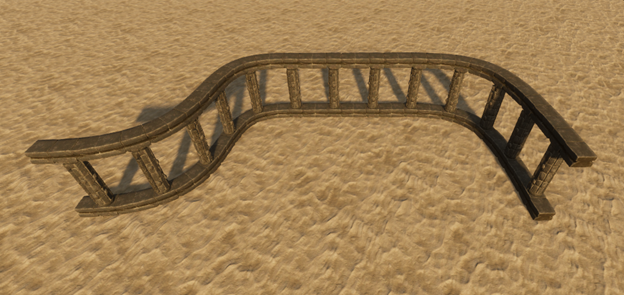

# Creating Spline

> 1.  **Create** an empty **GameObject**, position it at the intended location and add the **SplineDeformation** component.

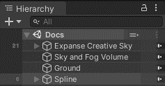

_Hierarchy window._

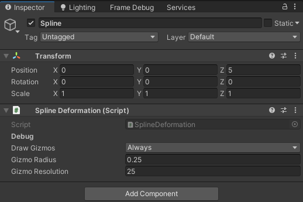

_Inspector window._

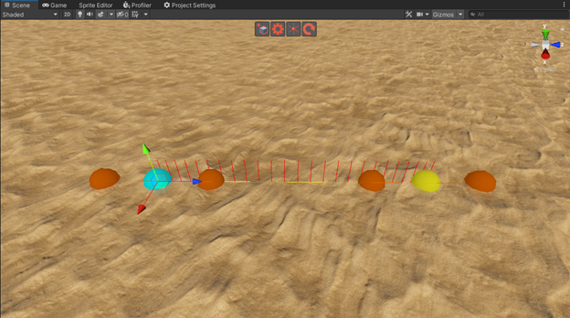

_Scene window._

**Spline** displays several **gizmos**:

- The **blue sphere** gizmo is the first base node of the spline. You can select it by clicking. You can move the node to change the shape of the spline.
- The **yellow sphere** gizmo is any other base node of the spline. You can select it by clicking. You can move the node to change the shape of the spline.
- The **dark orange sphere** gizmos are tension nodes. These nodes dictate the spline’s flow between the base nodes. You can select them by clicking. You can move the nodes to change the shape of the spline.
- The **yellow line** gizmo shows the shape of the spline.
- The **red line** gizmos show the rotation of the spline.

> 2.  **Select** a **node** to view it’s **settings**.

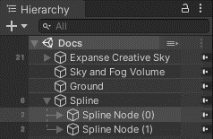

_Hierarchy window._

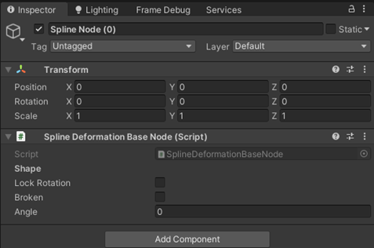

_Inspector window._

- **Lock Rotation** locks the base node’s tension nodes to the current **forward** axis of the node when enabled.
- **Broken** allows the base node’s tension nodes to point in different directions when enabled.
- **Angle** is added to the rotation of the node’s transform.

> 3. **Manage** the nodes.

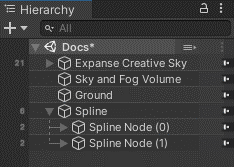

_Select a node and press **ctrl+d** to duplicate it._

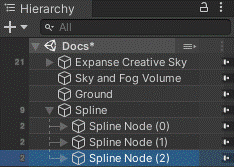

_Drag a node to change the order._

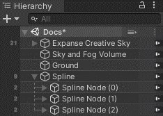

_Select a node and press **del** to delete it._

# Creating Zone

> 1. **Create** an empty **GameObject**, position it at the intended location and add the **DeformationZone** component.

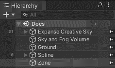

_Hierarchy window._

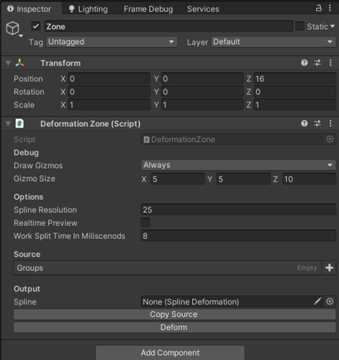

_Inspector window._

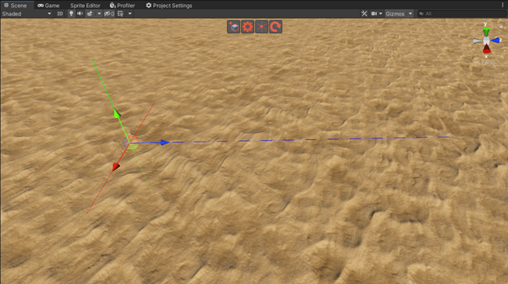

_Scene window._

**Zone** displays several **gizmos**:

- The **blue line** gizmo is the axis that will follow the spline after deformation.
- The **red line** and green line gizmos describe the remaining axes.

<ins>! The point where these lines cross will be mapped to the start of the spline.</ins>

> 2. **Assign** a **spline** to the zone in the **Output** section. You may also want to **configure** the zone:

- **Spline Resolution** is the number of samples on the spline per segment. A higher amount will result in higher quality, but it will also lower the performance.
- **Realtime Preview** will automatically update the deformation when enabled.
- **Work Split Time In Milliseconds** is the amount of time the real-time preview is allowed to take every frame. The higher the value, the faster the deformation will be updated, but high values might lower the framerate.

> 3. **Prepare objects** for deformation.

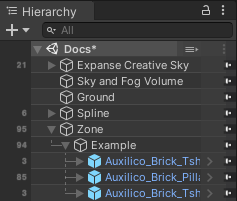

_Hierarchy window. **Any GameObject** on the scene can be assigned to the zone, however, it’s good practice to keep your **structures** parented to a **single** object that is parented to the object with the zone._

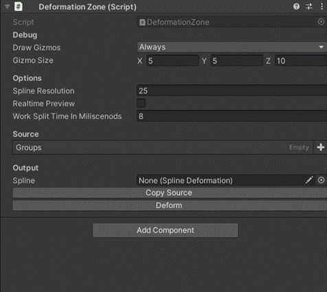

_Inspector window._

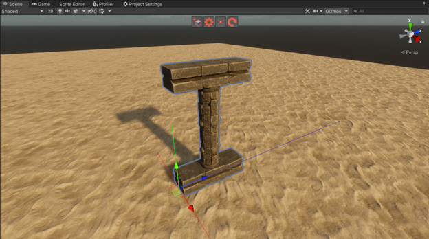

_Scene window._

**Group** has several **settings**:

- **Duplicates** is the number of additional copies of the object.
- **Duplicate Offset** is the displacement of each consecutive duplicate.
- **Stretch** is the scale that will be applied along the spline.

> 4. **Press** the **Copy Source** button to update objects undergoing deformation. The objects will be marked as non-selectable by default.

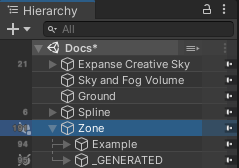

_Hierarchy window. The object named **\_GENERATED** will be used for deformation. It can be freely moved, renamed, or deleted._

> 5. **Press** the **Deform\*8 button to deform the objects manually or enable **Realtime Preview\*\*.

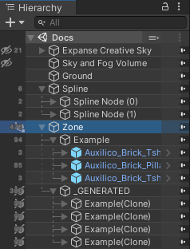

_Hierarchy window._

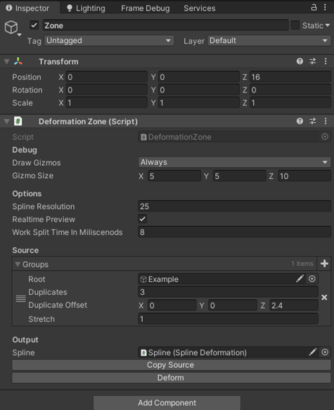

_Inspector window._

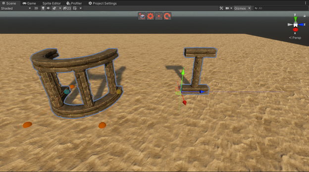

_Scene window._

# Removing Spline

> 1. **Remove** the **SplineDeformation** component.
> 2. **Remove** the **nodes** if you don’t want to keep them.

# Removing Zone

> 1. **Remove** the **DeformationZone** component.
> 2. **Right-click** the object named **\_GENERATED** and select **Deformation/Zone Cleanup** to remove all components required to deform the object.
> 3. **If** an object named **\_GENERATED** is a child of an object with a **DeformationZone** component, it will be automatically treated as the deformation target. Consider renaming it.
